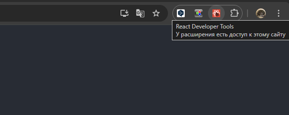

# Фреймворк React JS (семинары)

## Урок 1. Знакомство с React и первые компоненты. Работа с JSX

1. Развернуть новый проект с использованием create-react-app.
2. Создать компонент Message, отображающий переданный ему props текст.
Стилизовать компоненты через css (при желании можно использовать less или sass).
3. Дополнительное задание: Установить расширение React Devtools.
